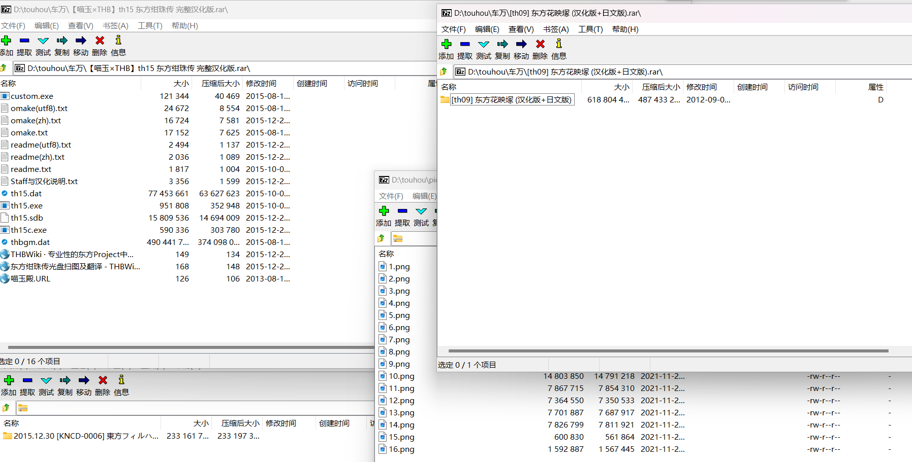
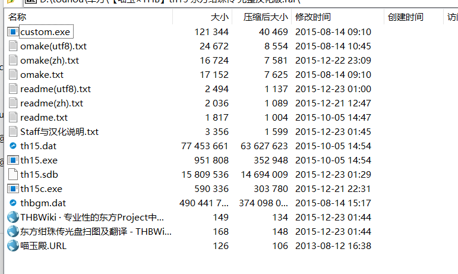

# Only One Layer of Folder after Unzipping
# 解压后只有一层文件夹

## 简介

一个简单的工具帮助处理只想解压出一层文件夹的强迫症问题，目前支持处理 `.zip` `.7z` `.tar` 格式的压缩包

## 使用情况 

你是否曾有过一下苦恼：
1. 下载了多个压缩包，因为强迫症只想解压出一层文件夹，因此不得不打开每一个压缩包来决定是 `提取到当前位置` 还是 `提取到"***\"`

(有的压缩包内含有一个文件夹或只有单个文件，可以直接提取；有的却直接是文件，需要要提取到文件夹内)
2. 以为压缩包内是单个文件夹，直接解压，结果里面的文件喷涌而出，和目录中的其他文件混杂在一起，想清理却又不想一个个比对文件名删除

(修改时间各不相同，如果一不小心提取到本身就有很多文件的目录下，删除非常麻烦)

如果有过如上困扰，那么该工具或许可以帮助你

## 使用方法

有两种使用方法，一是直接使用编译好的exe，二是直接运行Python脚本（需要安装依赖），二者都需要通过命令行输入参数运行
可用参数如下：

| Parameter   | Description          |
| :---------: | :------------------: |
| --path      | 指定要处理压缩包或者目录，若为目录则会处理该目录下所有压缩包，可为绝对路径或相对路径，默认为当前目录 |
| --extract   | 启用提取模式，以只生成一层文件夹的形式提取压缩包，若只有单个文件则直接提取 |
| --overwrite | 仅在 `--extract` 启用时有效，目录下若有同名文件夹或文件，则覆盖 |
| --clean     | 启用清理模式，清理不小心解压到当前目录的巨大多文件 |

各个选项是互不冲突的，可以同时选择 `--extract` 和 `--clean` 

## 提醒

毕竟是直接对文件操作，所以总归是有风险的，这是需要注意的。不过程序在Windows和Linux上都经过了一些测试，大抵是没问题的